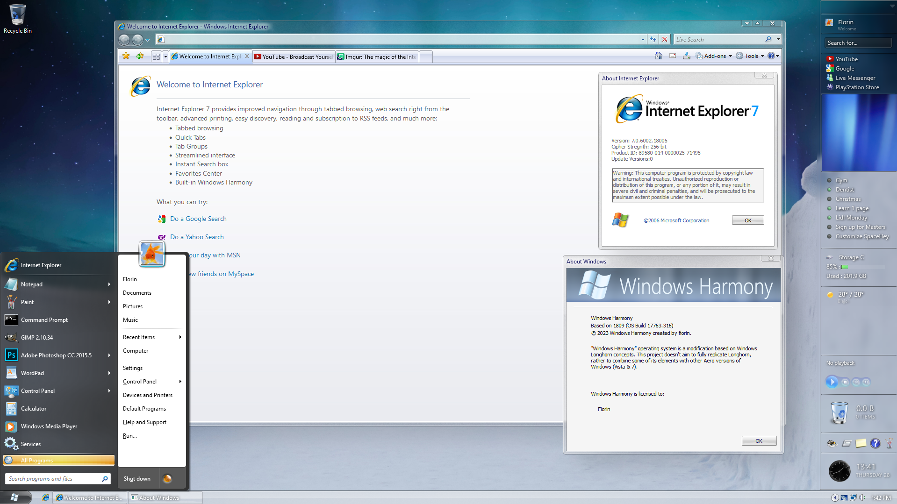

# What is Windows Harmony?

**"Windows Harmony"** operating system is a modification based on Windows Longhorn concepts. This project doesn't aim to fully replicate Longhorn, rather to combine some of its elements with other Aero versions of Windows (Vista & 7). This pack will allow anyone to customize their LTSC 2019 Windows (or 1809 build) into my Windows Harmony look and feel!

## Features:
- **NO** Stardock software needed (Windowblinds or other)! Free and usually trusted programs included *(minus AeroGlass, but eh sue me)*.
- Includes themes, wallpapers, cursors, system sounds (half-custom created by me, half-taken from Vista), user pictures, screensavers, icons, start menu and its skins, taskbar skins, gadget bar.
- Includes a bonus Internet Explorer 7 theme for Firefox 115ESR (installer also included) with custom interface, about box, aero compatible, icon swap, omni.ja tweaks (homepage, new tab page, inprivate page) and modified TipTab extension.
- Includes optional applications: Vista's Photo Viewer, Paint, Windows Media Player 11, Classic Sticky Notes, skinned WinFlip (Flip3D), Windows Movie Maker 6 and Windows Media Center 8.8.5.
- Includes Sample Media: Sample Music (4 tracks created by me to hear what the concept is about) and Sample Pictures (additional wallpaper-quality pictures).
- Custom Branding.
- Restored classic parts of Windows via WinaeroTweaker tweaks.

### Known issues:
- Regular taskbar will show during boot (enable the Disable_Startup_delay.reg to minimze the time to pop-up)
- Sometimes the sound flyout doesn't show (no idea why)
- Startup sound may not be triggered (disable fast startup to fix it)
- Retrobar doesn't hide the extra Network icon (make it as a moon or sun in Final tray icons using CustomizerGod)
- Setting a different locale from en_US may break some branding.

###### This pack may be applied up to 1909 for AeroGlass because the original dev of it has abandoned the project (however the icons, need manual replacement as 1903+ now used .mun/.mui resources in SystemResources instead of normal .dll in system32). 2004-22H2 users can still use the theme however without any Aero transparency.
###### Be on the look-out for a Harmony Christmas pack in December!

## Screenshots:

## Download link:

- [Rinfox (IE7,8 theme) has been removed from the zip because of new developments and can be found here](https://github.com/florinsdistortedvision/rinfox_updated)
- Pack has been split into 2 parts to help aid the download speeds:
  * Theme pack
  * Optional Applications (Vista's Photo Viewer, Paint, Windows Media Player 11, Classic Sticky Notes, skinned WinFlip/Flip3D, Windows Movie Maker 6 and Windows Media Center 8.8.5.)
- [Download the pack on archive.org](https://archive.org/details/windows-harmony-pack-for-ltsc-2019/)

## Credits:

1. **Theme:**
- [Aerospace: Pearl by vaporvance](https://www.deviantart.com/vaporvance/art/Aerospace-Pearl-2-for-Windows-10-1903-22H2-977628287)
- [RetroBar by dremin](https://github.com/dremin/RetroBar)
- [OldNewExplorer by Tihiy](https://msfn.org/board/topic/170375-oldnewexplorer-119/)
- [UltraUXThemePatcher by Manuel Hoefs](https://mhoefs.eu/software_uxtheme.php?ref=syssel&lang=en)
- [Glass8 (AeroGlass) by Big Muscle](https://arukateru.com/glass8/) - nuked site, mirror provided
- [uDWM patches by arukateru/Alcatel](https://windows7themenew2.carrd.co/)

2. **Wallpapers:**
- [Abstract (still) by Motion Background](https://www.vecteezy.com/video/1793075-blue-shining-ray-of-light)
- Aurora by unknown/Drakonian? - unknown
- [Borealis by Frans van Heerden](https://www.pexels.com/photo/aurora-borealis-624015/)
- [Glass by Konstantin Olsen](https://www.pexels.com/photo/blue-glass-building-287263/)
- [Green Field by Giuseppe Di Maria](https://www.pexels.com/photo/tree-on-a-green-hill-16603111/)
- [Summer Grass by Fabien Burgue](https://www.pexels.com/photo/green-grass-hd-wallpaper-2083502/)
- [Winter Bird by Erik Karits](https://www.pexels.com/photo/brown-and-white-bird-on-tree-branch-covered-with-snow-3738621/)

3. **Aero Cursors** by Microsoft/HerbysTweaks.net
4. **System Sounds** by part-me (florin) / part-Microsoft
5. **User Pictures and Screensavers** by Microsoft
6. **Icons:**
- Icons by Microsoft
- Branding by me (florin)
- [CustomizerGod by door2windows](https://www.door2windows.com/customizergod/)
  
7. **Sample Media:**
- Sample Music by me (florin)
- Sample Pictures:
  - [Bug Me by Joseba Garcia Moya](https://www.pexels.com/photo/bug-on-green-leaf-18133777/)
  - [Dolphin by Kammeran Gonzalez-Keola](https://www.pexels.com/photo/flock-of-dolphins-swimming-in-clear-water-7082123/)
  - [Leaf Texture by Microsoft/Ted Dayton](https://windowswallpaper.miraheze.org/wiki/Windows_7_Beta#/media/File:Img5_(Windows_7_Beta).jpg)
  - [Sunflower by Pixabay](https://www.pexels.com/photo/yellow-sunflower-541484/)
  - [Underwater by shalamov](https://depositphotos.com/photo/bora-bora-underwater-12656060.html)
  - [WaterDrops_2 by Microsoft/JP Peter](https://apps.microsoft.com/store/detail/waterdrops-by-jp-peter/9MSVJT3XKXRL?hl=en-us&gl=us)

8. **Gadget Bar:**
- [Rainmeter by Rainmeter team](https://www.rainmeter.net/)
- [Longhorn Sidebar for Rainmeter by fediaFedia](https://www.deviantart.com/fediafedia/art/Longhorn-Sidebar-for-Rainmeter-947066452)

9. **Start Menu:**
- [Open-Shell by Open-Shell team](https://github.com/Open-Shell/Open-Shell-Menu)
- [LonghornMOD Hillel skin by juniper7/Splitwirez](http://www.classicshell.net/forum/viewtopic.php?f=17&t=5868)

10. **Logon Background:**
- [logon by Microsoft](https://windowswallpaper.miraheze.org/wiki/Longhorn#/media/File:Windows_Longhorn_Build_4039_unused.jpg) - upscaled

11. **Restoring Classic Parts of Windows:**
- [Winaero Tweaker by Winaero team](https://winaero.com/winaero-tweaker/)

12. **Optional Applications:**
- Classic Photo Viewer by Microsoft
- MSPaint Vista Version by Microsoft
- Windows Media Player 11 by Microsoft
- Classic Sticky Notes by winaero team
- [Flip3D / WinFlip by Koji Higashino](http://tokyodownstairs.blogspot.com/2007/11/winflip.html)
- Windows Movie Maker 6 by Microsoft
- Windows Media Center 8.8.5 by Microsoft

13. **Bonus - Firefox IE7 Theme:**
- Firefox 115ESR by Mozilla
- rinfox 0.4.1 by travis(windows experience), fixes and inPrivate logo by angelbruni
- omni.ja html swaps by me (florin)
- icons and resources by Microsoft
- [QuickTabs / TipTab by William Wong / modified by me (florin)](https://addons.mozilla.org/en-US/firefox/addon/tip-tab/)

## Enjoy living in and with Harmony!

